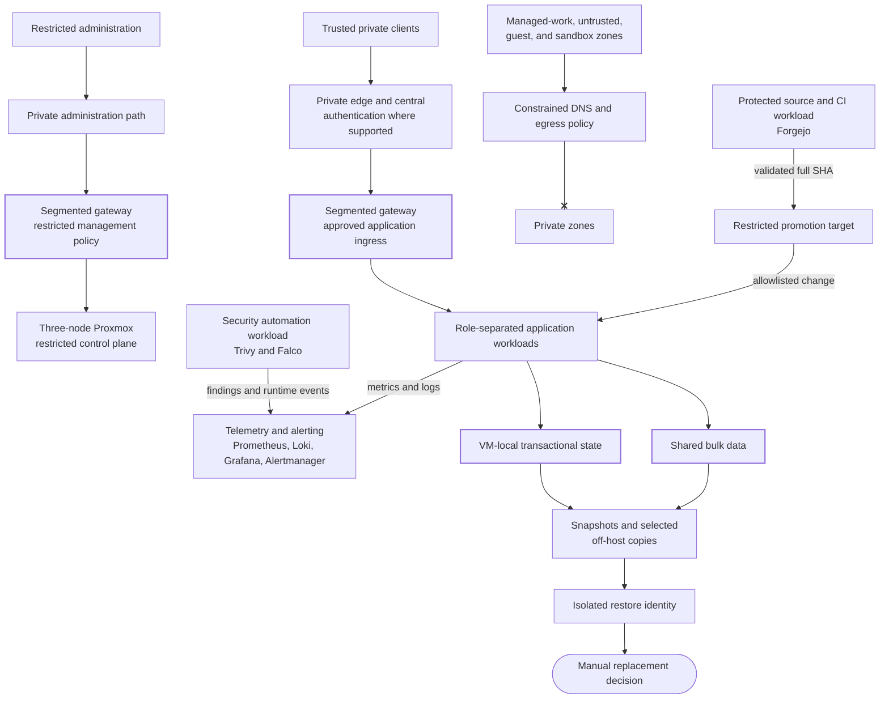

# Tamriel Homelab

**Security-Engineered Self-Hosted Infrastructure**

> [!NOTE]
> Public portfolio published September 19, 2026. This repository contains
> reviewed examples and evidence; production configuration and operational
> history stay in private Forgejo repositories.

I designed a three-node Proxmox homelab architecture for a private cloud and
security engineering environment. The design combines segmented networking,
centralized identity, security telemetry, infrastructure automation, controlled
software delivery, and layered recovery.

This project is presented as an engineering case study, not a list of hosted
applications. It focuses on the decisions, controls, failures, and validation
that make the environment operable and defensible.

Start with the [three evidence paths](#three-evidence-paths) or the
[reviewed runtime screenshots](#runtime-evidence).

## Architecture

Solid arrows show allowed control, data, or authority flow; the cross-ended arrow
shows that constrained client zones have no route to private zones. The repeated
gateway labels represent logical policies on one network boundary, not separate
appliances. This is a logical trust model, not a physical topology. Public names
are role-based aliases, and production addresses, domains, host identities, and
management paths are intentionally omitted.

## Engineering Pillars

| Pillar | Represented capabilities | Public evidence status |
|---|---|---|
| Platform and storage | Clustered virtualization, workload separation, local database state, shared bulk storage, and GPU-backed workloads | [Architecture](docs/architecture.md), [platform catalog](docs/platform-catalog.md), and [reviewed three-node cluster health](evidence/screenshots/README.md#proxmox-cluster-health); broader storage and availability claims remain limited |
| Network and identity | Segmented trust zones, private ingress, centralized authentication, DNS controls, and restricted management paths | [Network and identity design](docs/network-and-identity.md) and [threat model](docs/threat-model.md) drafted; zone-policy validation and runtime evidence planned |
| Detection and observability | Centralized metrics and logs, vulnerability deltas, runtime detections, malware scanning, and alert routing | [Trivy](automation/trivy/README.md) code/tests with [reviewed finding presentation](evidence/screenshots/README.md#vulnerability-management) and [alert delivery](evidence/screenshots/README.md#actionable-security-alert); [Falco](automation/falco/README.md) and the public [Grafana example](automation/monitoring/README.md) remain static evidence; malware scanning is catalog-only |
| Automation and delivery | Idempotent hardening, dependency updates, protected changes, exact-revision validation, controlled promotion, and rollback | [Ansible](automation/ansible/README.md) static evidence; [delivery recovery and rollback](evidence/drills/2026-08-24-fail-closed-delivery-rollback.md) validated; [Forgejo Compose validation](evidence/screenshots/README.md#forgejo-validation) observed; enforced repository controls and dependency-update automation remain unproven |
| Reliability and recovery | VM snapshots, off-host copies, isolated restores, health checks, and storage dependency controls | [Synthetic isolated restore](evidence/drills/2026-08-24-isolated-synthetic-restore.md) publicly evidenced; [storage-startup policy](automation/recovery/README.md) executable; private backup-job evidence pending |

## Three Evidence Paths

Each path moves from the engineering decision to inspectable implementation and
repeatable validation without requiring access to the private environment.

1. **[Actionable vulnerability management](docs/case-studies/actionable-vulnerability-management.md):**
   follow the alert-noise decision into the
   [scanner and delta engine](automation/trivy/README.md) and its 27 synthetic
   tests, then the [reviewed delivered alert](evidence/screenshots/README.md#actionable-security-alert).
   Status: **Publicly evidenced** for the implementation and observed notification;
   not a remediation or sustained-delivery claim.
2. **[Fail-closed infrastructure delivery](docs/case-studies/fail-closed-infrastructure-delivery.md):**
   follow exact-revision validation into the
   [restricted target helper](automation/ci/target/restricted_deploy.py) and the
   [dated recovery and rollback drill](evidence/drills/2026-08-24-fail-closed-delivery-rollback.md).
   Status: **Publicly evidenced** as a validated implementation;
   [Forgejo validation](evidence/screenshots/README.md#forgejo-validation) is also
   observed, while operated promotion and rollback evidence remain pending.
3. **[Recovery and storage dependencies](docs/case-studies/recovery-and-storage-dependencies.md):**
   follow state-authority boundaries into the
   [isolated restore implementation](automation/recovery/restore.py) and the
   [dated restore drill](evidence/drills/2026-08-24-isolated-synthetic-restore.md).
   Status: **Publicly evidenced** for the synthetic restore; private backup and
   operated recovery evidence are pending.

The [claim-to-evidence matrix](evidence/validation-matrix.md) records the complete
claim boundaries. The [public validation runs](https://github.com/arviiyer/tamriel-homelab/actions/workflows/validate.yml)
execute the [CI definition](.github/workflows/validate.yml) against published
automation and scan repository history. A network change blast-radius case study
remains optional work.

## Runtime Evidence

Four reviewed captures, with full-resolution images and review records one link away:

- [Trivy vulnerability dashboard](evidence/screenshots/README.md#vulnerability-management)
- [Successful Forgejo validation](evidence/screenshots/README.md#forgejo-validation)
- [Actionable Trivy alert in Discord](evidence/screenshots/README.md#actionable-security-alert)
- [Three-node Proxmox cluster health](evidence/screenshots/README.md#proxmox-cluster-health)

## Documentation

- [Architecture](docs/architecture.md)
- [Network and identity design](docs/network-and-identity.md)
- [Threat model](docs/threat-model.md)
- [Architecture decision records](docs/adr/README.md)
- [Platform catalog](docs/platform-catalog.md)
- [Current handoff](docs/handoff.md)
- [v1 release record](docs/release-readiness.md)
- [Content plan](docs/content-plan.md)
- [Publication policy](docs/publication-policy.md)
- [Publication roadmap](ROADMAP.md)

## Repository Boundary

This repository is deliberately separate from the production repositories. It
contains no production Git history and is never used for deployment. Artifacts
are selected individually, rewritten around public aliases and synthetic data,
and validated without private infrastructure.

See the [publication policy](docs/publication-policy.md) for the complete safety
and evidence standard.

## Current Status

The public v1 portfolio includes architecture and threat-model documentation,
tested automation, three case studies, four reviewed runtime captures, and dated
synthetic delivery and restore drills. Public access, evidence links, and GitHub
rendering have been verified without authentication. See the
[release record](docs/release-readiness.md) for validation and the
[GitHub releases](https://github.com/arviiyer/tamriel-homelab/releases) for versioned snapshots.

Network and identity validation, live Ansible/Falco transactions, remaining
dashboard query execution, operated promotion/rollback, and private backup
recovery remain follow-up evidence tasks. Their claims stay limited in the
[claim-to-evidence matrix](evidence/validation-matrix.md). See the
[release verification](docs/release-readiness.md#release-verification) and the
[current handoff](docs/handoff.md) for review results and follow-up work.
