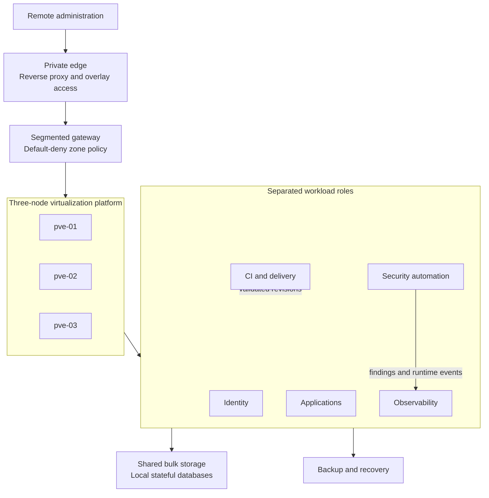

# Tamriel Homelab

**Security-Engineered Self-Hosted Infrastructure**

> [!NOTE]
> This public portfolio is under construction. Production configuration and
> operational history remain in a private self-hosted Forgejo environment. This
> repository will contain only reviewed, sanitized implementations and evidence.

I designed and operate a three-node Proxmox homelab as a private cloud and
security engineering environment. The platform combines segmented networking,
centralized identity, security telemetry, infrastructure automation, controlled
software delivery, and layered recovery.

This project is presented as an engineering case study, not a list of hosted
applications. It focuses on the decisions, controls, failures, and validation
that make the environment operable and defensible.

## Architecture

Public names are role-based aliases. The diagram intentionally omits production
addresses, domains, host identities, and management paths.

## Engineering Pillars

| Pillar | What the platform demonstrates | Public evidence status |
|---|---|---|
| Platform and storage | Clustered virtualization, workload separation, local database state, shared bulk storage, and GPU-backed workloads | Documentation drafted; runtime evidence planned |
| Network and identity | Segmented trust zones, private ingress, centralized authentication, DNS controls, and restricted management paths | Threat model drafted; case study planned |
| Detection and observability | Centralized metrics and logs, vulnerability deltas, runtime detections, malware scanning, and alert routing | Trivy executable evidence; Falco and Grafana static evidence; runtime screenshots planned |
| Automation and delivery | Idempotent hardening, dependency updates, protected changes, exact-revision validation, controlled promotion, and rollback | Ansible static evidence; delivery recovery and rollback validated on a disposable target; operated workflow evidence pending |
| Reliability and recovery | VM snapshots, off-host copies, isolated restores, health checks, and storage dependency controls | Dated drill evidence planned |

## Evidence

The repository links claims to one or more of these evidence types:

- [executable vulnerability automation](automation/trivy/README.md) tested
  against synthetic fixtures;
- [host hardening and controlled patching](automation/ansible/README.md) with
  rendered-policy tests and Ansible syntax validation;
- [Falco runtime detection](automation/falco/README.md) with modern eBPF
  deployment, narrow tuning controls, and structured event routing;
- [security observability dashboard](automation/monitoring/README.md) with
  file-owned Grafana provisioning and tested telemetry references;
- [fail-closed exact-revision delivery](automation/ci/README.md) with separate
  validation and promotion jobs, a forced-command target helper, and 30 synthetic
  policy and transaction tests, plus a
  [dated disposable-target drill](evidence/drills/2026-08-24-fail-closed-delivery-rollback.md)
  for real Compose recovery and rollback;
- a [public CI definition](.github/workflows/validate.yml) for validation and
  secret scanning, with a public run still pending;
- sanitized architecture and threat-model documents;
- planned redacted screenshots from the operated environment;
- evidence-backed delivery and vulnerability case studies, with recovery still
  planned; and
- a [claim-to-evidence matrix](evidence/validation-matrix.md).

## Initial Case Studies

1. **[Actionable vulnerability management](docs/case-studies/actionable-vulnerability-management.md):**
   converting recurring container, configuration, and secret scans into new,
   fixed, and stale-control signals.
2. **[Fail-closed infrastructure delivery](docs/case-studies/fail-closed-infrastructure-delivery.md):**
   validating exact revisions and promoting them through a restricted deployment
   boundary with health checks and rollback.
3. **Network change blast radius:** redesigning a high-risk migration around
   staged changes, validation gates, and explicit rollback points.
4. **Recovery and storage dependencies:** protecting stateful services and
   preventing workloads from starting against unavailable shared storage.

## Documentation

- [Architecture](docs/architecture.md)
- [Threat model](docs/threat-model.md)
- [Platform catalog](docs/platform-catalog.md)
- [Current handoff](docs/handoff.md)
- [Content plan](docs/content-plan.md)
- [Publication policy](docs/publication-policy.md)
- [Publication roadmap](ROADMAP.md)

## Repository Boundary

This repository is deliberately separate from the production repositories. It
contains no production Git history and is never used for deployment. Artifacts
are selected individually, rewritten around public aliases and synthetic data,
and validated without private infrastructure.

See the [publication policy](docs/publication-policy.md) for the complete safety
and evidence standard.

## Current Status

The repository foundation and publication-control framework are in place. The
Trivy slice is executable evidence, and fail-closed delivery now has a dated
synthetic validation of its real recovery and rollback path. The Ansible, Falco,
and Grafana slices are complete as reviewed static evidence and await live
transactions or runtime screenshots before stronger claims are made. See the
[current handoff](docs/handoff.md) and [roadmap](ROADMAP.md) for the exact restart
point and remaining publication gates.
