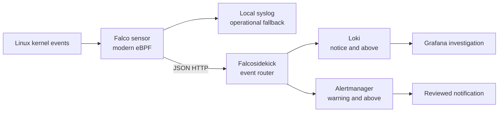

# Runtime Event Flow

## Purpose

This flow detects unexpected host and container behavior, preserves searchable
events, and separates the complete event stream from interruptive alerting.

## Boundaries

| Boundary | Control |
|---|---|
| Kernel to sensor | Falco runs on selected Linux guests with the modern eBPF engine; hypervisors are outside this public role's target group |
| Sensor to router | The endpoint is an explicit inventory variable with no embedded credentials; ingress must be restricted to sensor hosts |
| Router to log store | Events at `notice` and above are sent to Loki for investigation |
| Router to alerting | Events at `warning` and above are sent to Alertmanager v2 to reduce interruptive noise |
| Tuning | Local exceptions append to named upstream rules and require process plus workload context |

## Failure Behavior

- Candidate configuration and rules are checked together with `falco --dry-run`
  before one managed configuration activates an immutable rules release.
- Hosts are changed one at a time. A failed host stops the rollout.
- File watching is disabled so Falco cannot hot-reload a partially activated
  policy.
- If the loopback process-health endpoint does not remain reachable after a
  policy change, the previous managed configuration is restored before the play
  fails. This checks process liveness, not eBPF event processing.
- Syslog remains enabled as a local event path when the HTTP router is
  unavailable. This is not a durable delivery guarantee.
- Falcosidekick is a router, not a persistent queue. A router or downstream
  outage can still create an event-delivery gap and must be monitored separately.

## Event Contract

[`tests/fixtures/falco-event.json`](tests/fixtures/falco-event.json) and
[`tests/fixtures/falco-notice-event.json`](tests/fixtures/falco-notice-event.json)
are synthetic examples of the JSON fields and priority thresholds used for
routing. They are not captured runtime evidence.

The operated environment's complete suppression set, internal destinations,
notification receivers, and raw event history remain private.
