# Actionable Trivy Scan Pipeline

This public implementation scans container references and repository
configuration, compares complete scans, and exports actionable Prometheus
metrics. It is a sanitized and hardened derivative of the pipeline operated in
the private homelab.

Reviewed runtime evidence shows [finding presentation](../../evidence/screenshots/README.md#vulnerability-management)
and [one fix-aware notification delivered to Discord](../../evidence/screenshots/README.md#actionable-security-alert).
The captures complement the synthetic tests; they do not prove successful
remediation, latest-scan completeness, or continued notification delivery.

## Problem

A recurring scanner that repeatedly reports the same findings creates noise. A
scanner that silently fails is worse: an empty or partial result can look like a
large remediation event.

The public alert rules use an illustrative eight-day freshness window so stale
control behavior can be tested. That value is a synthetic example, not the
private environment's scan schedule.

This pipeline separates three questions:

1. What findings exist now?
2. Which findings are new or absent from the last complete scan?
3. Did every configured scanner complete successfully?

## Data Flow

```mermaid
flowchart LR
    repositories[Configured Git repositories]
    checkout[Exact-revision checkout]
    compose[Compose image extraction]
    trivy[Trivy configuration, secret, and image scans]
    validation[Strict JSON and completeness validation]
    delta[Identity-based delta calculation]
    metrics[Prometheus metrics]
    gateway[Pushgateway]
    alerts[Prometheus alerts]
    baseline[Last complete baseline]

    repositories --> checkout --> compose --> trivy --> validation --> delta
    baseline --> delta
    delta --> metrics --> gateway --> alerts
    validation -->|all scans complete| baseline
    validation -->|any failure| health[Failure health metrics]
    health --> gateway
```



## Security and Reliability Properties

- Remote clone URLs must use HTTPS and may not contain userinfo, query strings,
  or fragments. Authentication belongs in an external Git credential helper or
  environment-specific Git configuration. Absolute local paths are accepted for
  tests and offline use.
- Each repository is fetched at its configured revision into a temporary
  checkout with terminal prompting disabled.
- Compose parsing fails on malformed documents and unresolved image variables.
- Trivy's default exit behavior is made explicit with `--exit-code 0`; findings
  are data, while execution and output failures remain non-zero errors.
- Every required repository-level result must exist and contain valid JSON.
- Trivy output must include the supported schema version, artifact metadata, and
  report identity. A `Results` collection is validated when present; Trivy 0.73
  legitimately omits it when no supported target produces a result.
- Any failed clone, parse, configuration scan, secret scan, or image scan blocks
  baseline promotion.
- A baseline manifest binds state to its repository set and schema. Missing or
  mismatched state fails closed rather than silently becoming a first run.
- An advisory file lock prevents overlapping scans from publishing conflicting
  findings and baseline state.
- Findings metrics and scan-health metrics use separate Pushgateway jobs. A
  failed scan can report unhealthy status without deleting the last known-good
  findings.
- Baselines are replaced through a same-filesystem rename while the previous
  directory remains available. If findings publication or replacement fails,
  the previous baseline is restored.
- The first complete scan establishes a baseline without alerting on every
  existing vulnerability or misconfiguration.

## Finding Identity

Delta identity excludes metadata that can change without representing a new
finding.

Vulnerabilities are identified by:

```text
repository + image + target + package + package path + vulnerability ID
```

Installed version, severity, and fixed version are attached metadata. Changes to
these fields do not create absent/new findings while the complete identity above
remains unchanged. The image field includes the full reference: changing an image
tag or digest, target, or package path can produce absent/new findings even when
the same package and vulnerability persist. Security-relevant metadata changes
within an unchanged identity are reported separately when severity increases or
a fix becomes available.

Misconfigurations are identified by:

```text
repository + file path + check ID + resource
```

Source line remains report metadata for triage but is excluded from identity so
unrelated line movement does not create a false new finding.

Secrets are identified by:

```text
repository + file path + rule ID + start line
```

Secrets are reported from every complete scan rather than delta-gated.

## Secret-Scanning Boundary

`trivy repo --scanners secret` scans the checked-out repository tree in this
pipeline. It is not described as a full Git-history scan. The public repository
uses Gitleaks against complete Git history as an independent publication
control.

## Configuration

Create a local configuration from the example:

```bash
cp automation/trivy/repositories.example.tsv automation/trivy/repositories.tsv
```

Each non-comment line has three tab-separated fields:

```text
alias    clone URL    revision
```

Aliases must contain lowercase letters, digits, underscores, or hyphens. Use a
Git credential helper for private repositories. Do not add tokens to the file or
URL.

Supported environment variables:

| Variable | Purpose | Default |
|---|---|---|
| `REPOSITORIES_FILE` | Tab-separated repository configuration | `automation/trivy/repositories.tsv` |
| `BASELINE_DIR` | Last complete JSON baseline | `automation/trivy/var/baseline` |
| `PUSHGATEWAY_URL` | Optional Pushgateway base URL | Metrics are not pushed |
| `TMPDIR` | Parent directory for temporary scan state | `/tmp` |
| `INITIALIZE_BASELINE` | Must be `1` only for the first complete scan | `0` |

## Run

Requirements:

- Bash 5+
- Git
- Python 3.11+
- PyYAML 6.0.3
- Trivy
- curl

Establish the first baseline explicitly:

```bash
INITIALIZE_BASELINE=1 bash automation/trivy/scan.sh
```

Run subsequent scans:

```bash
bash automation/trivy/scan.sh
```

The initialization flag is rejected when a baseline already exists. Subsequent
scans require a valid manifest and calculate new, absent, and changed findings
against that baseline.

Each promoted baseline contains `_delta-report.json`, which lists exact new and
absent vulnerabilities, metadata changes, new misconfigurations, and the current
secret count for operator triage.

## Validate

Run the tests without Trivy or production access:

```bash
python3 -m unittest discover \
  -s automation/trivy/tests \
  -p 'test_*.py' \
  -v
```

The integration tests create a temporary Git repository and fake Trivy binary
to exercise scan orchestration. They verify both successful promotion and
byte-for-byte baseline preservation after scanner or Compose failures.

Validate the remaining artifacts:

```bash
bash -n automation/trivy/scan.sh
shellcheck automation/trivy/scan.sh
promtool check rules automation/trivy/prometheus-rules.yml
```

## Prometheus Metrics

Finding metrics:

- `trivy_vulnerabilities`
- `trivy_new_vulnerabilities`
- `trivy_fixed_vulnerabilities`
- `trivy_vulnerability_changes`
- `trivy_misconfigurations`
- `trivy_new_misconfigurations`
- `trivy_secrets`
- `trivy_scan_last_success_timestamp_seconds`

Control-health metrics:

- `trivy_scan_success`
- `trivy_scan_attempt_timestamp_seconds`
- `trivy_scan_duration_seconds`
- `trivy_scan_repository_success`

## Alert Policy

The example Prometheus rules alert on:

- every new critical vulnerability;
- new high vulnerabilities only when a fix is available;
- existing vulnerabilities reclassified as critical;
- existing high or critical vulnerabilities when a fix becomes available;
- every current-tree secret finding;
- new critical configuration findings;
- failed repository or overall scans; and
- stale attempts or stale complete baselines.

The fix-aware high-severity policy is an operational choice to prioritize work,
not a statement that unfixable findings have no risk. Current totals remain
visible for review and can drive a different policy in another environment.

## Limitations

- The repository list is expected to remain stable for a baseline series. Add or
  remove repositories by archiving the old baseline and establishing a new one.
- Images built locally without an `image` reference are not scanned by this
  repository-driven workflow.
- Mutable image tags can change between scans. Digest-pinned references provide
  stronger correspondence between source configuration and scanned content.
- Pushgateway and local filesystem state cannot form a true atomic distributed
  transaction. The pipeline installs the candidate baseline, publishes findings,
  and restores the prior baseline if publication fails. A process or host crash
  inside that short window can still require operator reconciliation.
- Failures after temporary workspace creation publish health when they reach a
  handled scan or promotion boundary. Failures before health publication, such
  as unavailable local tools or storage, are detected by the missing/stale
  health alerts rather than an immediate failure metric.
- Baseline JSON includes file paths and secret-finding metadata. Store it on
  access-controlled local storage and do not publish or back it up as portfolio
  evidence.
- This pipeline prioritizes actionable operations; it does not provide ticketing,
  exception expiry, exploitability analysis, or risk acceptance workflows.
