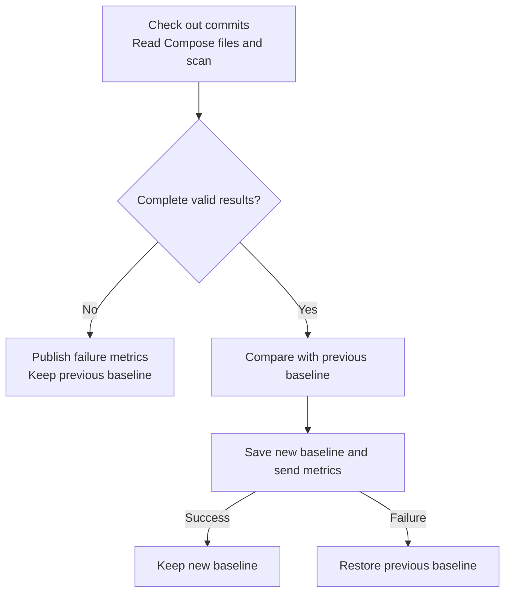

# Trivy scans

Scans repository files and images listed in Compose files, compares results with
the last complete scan, and exports Prometheus metrics.

[How the alerting works](../../docs/case-studies/actionable-vulnerability-management.md)

## Setup

Requirements: Bash 5+, Git, Python 3.11+, PyYAML 6.0.3, Trivy, curl, `flock`,
and `sha256sum`.

From the repository root, copy and edit the example repository list:

```bash
cp automation/trivy/repositories.example.tsv automation/trivy/repositories.tsv
```

Each non-comment line contains three tab-separated fields:

```text
alias    clone URL    revision
```

Aliases use lowercase letters, digits, underscores, or hyphens. Remote URLs must
use HTTPS without userinfo, query strings, or fragments. Use an external Git
credential helper for authentication. Absolute local paths work for offline use.

| Variable | Purpose | Default |
|---|---|---|
| `REPOSITORIES_FILE` | Repository configuration | `automation/trivy/repositories.tsv` |
| `BASELINE_DIR` | Last complete JSON baseline | `automation/trivy/var/baseline` |
| `PUSHGATEWAY_URL` | Optional Pushgateway URL | Metrics are not pushed |
| `TMPDIR` | Temporary scan storage | `/tmp` |
| `INITIALIZE_BASELINE` | Set to `1` for the first complete scan only | `0` |

## Run

From the repository root, save the first complete scan as a baseline:

```bash
INITIALIZE_BASELINE=1 bash automation/trivy/scan.sh
```

Then run subsequent scans:

```bash
bash automation/trivy/scan.sh
```

Use initialization only once. Later runs check that the saved baseline matches
the configured repositories. The first scan records existing vulnerabilities and
configuration issues without alerting on all of them.

Each baseline includes `_delta-report.json` with new/absent vulnerabilities,
metadata changes, new misconfigurations, and the current secret count. Store
baseline files privately: they contain paths and secret-finding metadata.

## Tests

Run from the repository root. Python tests need Git and the dependencies in
[requirements.txt](requirements.txt); they use a fake Trivy binary and temporary repositories.
The remaining checks need ShellCheck and `promtool`:

```bash
python3 -m unittest discover -s automation/trivy/tests -p 'test_*.py' -v
bash -n automation/trivy/scan.sh
shellcheck automation/trivy/scan.sh
promtool check rules automation/trivy/prometheus-rules.yml
```

## How it works


```mermaid
flowchart TB
    scan[Check out commits<br/>Read Compose files and scan]
    scan --> validate{Complete valid results?}
    validate -- No --> health[Publish failure metrics<br/>Keep previous baseline]
    validate -- Yes --> delta[Compare with previous baseline]
    delta --> commit[Save new baseline and send metrics]
    commit -- Success --> baseline[Keep new baseline]
    commit -- Failure --> rollback[Restore previous baseline]
```

Malformed Compose files, unresolved image variables, and failed clones or scans
block the new baseline. Trivy uses `--exit-code 0` so findings alone do not count
as scanner failures. JSON output must pass schema and metadata checks; Trivy 0.73
can omit `Results` when no supported target produces a result.

A lock prevents overlapping runs. The baseline manifest records the repository
set, schema, and file list. Findings and health use separate Pushgateway jobs.
The script keeps the old baseline directory until replacement and metrics
publication succeed, restoring it if either fails.

## Comparing results

| Type | Identity fields |
|---|---|
| Vulnerability | Repository, image reference, target, package, package path, vulnerability ID |
| Misconfiguration | Repository, file path, check ID, resource |
| Secret | Repository, file path, rule ID, start line |

The comparison ignores installed version, severity, and fixed version when
matching findings. Severity increases and newly available fixes are reported
separately. Changing the image tag/digest, target, or package path can produce an
absent/new pair even if the vulnerability remains.
Moving lines in a configuration file does not create a new finding. Secrets are
reported on every complete scan.

## Secret scans

Trivy scans the checked-out tree. Gitleaks handles full Git-history scanning in CI.

## Metrics and alerts

Finding metrics:

```text
trivy_vulnerabilities                 trivy_new_vulnerabilities
trivy_fixed_vulnerabilities           trivy_vulnerability_changes
trivy_misconfigurations               trivy_new_misconfigurations
trivy_secrets                         trivy_scan_last_success_timestamp_seconds
```

Health metrics:

```text
trivy_scan_success                   trivy_scan_attempt_timestamp_seconds
trivy_scan_duration_seconds          trivy_scan_repository_success
```

[Alert rules](prometheus-rules.yml) implement the
[alert policy](../../docs/case-studies/actionable-vulnerability-management.md#what-triggers-an-alert)
and flag failed or stale scans. The example freshness window is eight days.

## Limitations

- Changing the repository set requires archiving the baseline and starting a new
  series. Locally built images without an `image` reference are not scanned.
- Image tags can point to different content between scans. Pin digests to scan
  the same image content.
- Pushgateway and local disk cannot update atomically. The new baseline is saved
  before metrics are sent; a failed send restores the old one. A crash between
  these steps may leave them out of sync and need manual repair.
- Failures before health metrics can be published, such as missing tools or
  storage, rely on stale/missing-health alerts.
