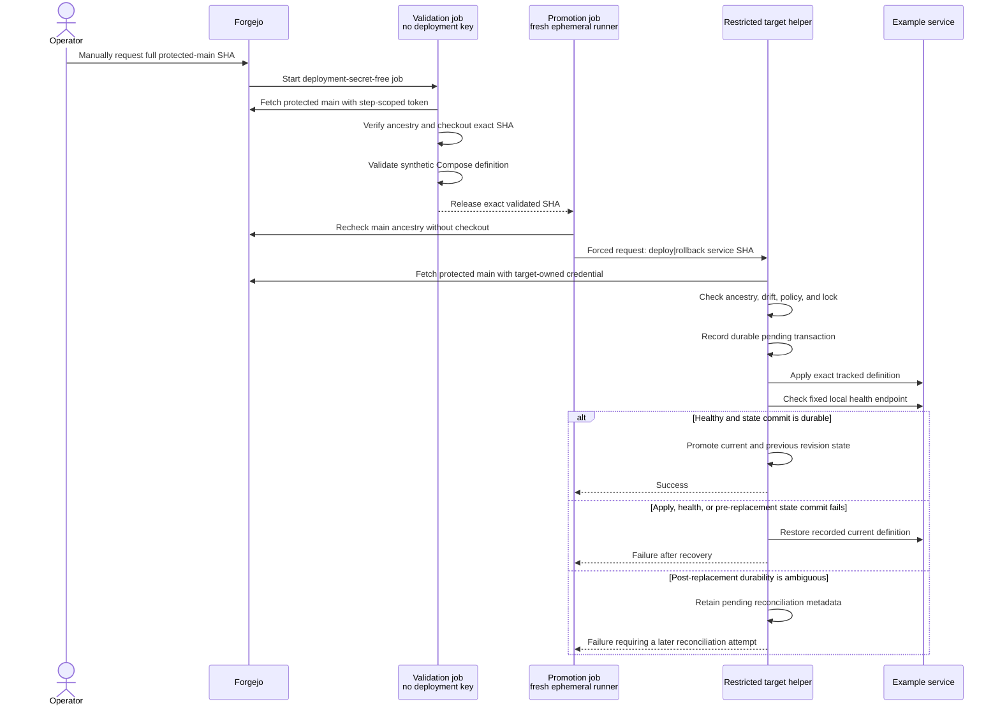

# Fail-Closed Infrastructure Delivery

## Problem

Infrastructure repositories can validate a change in CI without proving that the
same revision is later deployed. A broad deployment credential creates a second
risk: repository-controlled code or a compromised runner could turn validation
access into a general shell, Docker socket, or unrestricted production mutation.

The delivery boundary needed to answer two questions independently:

1. Was this exact source commit validated?
2. Can the target safely apply only the intended change and recover if it fails?

A branch name, mutable checkout, or successful historical pull request was not a
sufficient binding between those questions.

## Constraints

- Pull-request content must execute without deployment credentials.
- A merge must not automatically change a stateful service.
- The operator must select a full commit SHA from protected `main`.
- The promotion job must not execute content from the selected repository.
- A deployment credential must not provide a shell or general sudo access.
- Runtime credentials and persistent state must remain on the target.
- Failed validation, drift, apply, health, or state commit must stop promotion.
- The public example must run against synthetic state without private network
  access or production identifiers.

## Decision

Use a manual, exact-revision workflow with separate validation and promotion
jobs, followed by an independently enforced target-side transaction.

The validation job fetches protected `main`, verifies the supplied 40-character
SHA is reachable, checks out that exact commit, validates its Compose definition,
and publishes the SHA as a job output. For rollback, this SHA is a guard for the
expected current state rather than a caller-selected destination. The job has a
read-only repository token only during fetch and never receives the deployment
key.

The promotion job requires its `promotion` label to map to a dedicated ephemeral
runner. After validation, it compares the validated output with the original
operator input and independently rechecks protected-main ancestry using Git
metadata. It does not check out or execute repository content. Only the final
request step receives a source- and forced-command-restricted SSH key.

The target treats the request as untrusted. It re-fetches protected `main`,
checks ancestry again, verifies live configuration has not drifted, and permits
only a digest change for one allowlisted image. The runner cannot choose target
paths, Compose arguments, health endpoints, rollback destinations, or arbitrary
commands.

## Trust Flow

## Failure Handling

| Failure | Fail-closed behavior |
|---|---|
| Missing, abbreviated, or malformed SHA | Workflow and target reject the request |
| Revision is outside protected `main` | Validation, promotion, and target ancestry checks reject it |
| Validation fails | Promotion job is not eligible to start |
| Promotion runner executes repository content | Public policy tests fail |
| Unknown operation or service | Forced-command parser rejects it before target mutation |
| Live definition differs from recorded revision | Deployment stops for drift review |
| Candidate changes more than the image digest | Canonical Compose-model comparison rejects it |
| Candidate pull fails | No pending transaction or state change is created |
| Apply or health check fails | Recorded current definition is restored and rechecked |
| State write clearly fails before replacement | Current definition is restored immediately |
| State durability is ambiguous | Pending metadata remains and a later invocation reconciles durable state |
| Explicit rollback uses a stale guard SHA | Target rejects it rather than guessing operator intent |

## Validation

The public evidence includes:

- separate Forgejo validation and promotion workflow examples;
- account-wide and per-key forced-command restrictions;
- a narrow sudo rule and sanitized subprocess environment;
- a purpose-written target transaction with durable pending and revision state;
- 30 offline Python tests for workflow policy, real Git ancestry, deployment,
  recovery, and rollback behavior;
- an effective OpenSSH and `visudo` validation script that checks both matching
  and nonmatching source addresses; and
- a [dated disposable-target drill](../../evidence/drills/2026-08-24-fail-closed-delivery-rollback.md)
  using real forced-command SSH, sudo, Git, Compose, service health, automatic
  recovery, and guarded rollback.

The real-Git tests create temporary protected and unreviewed branches, fetch them
through the same `SystemAdapter` used by the helper, and prove an unreviewed
commit is not reachable from protected `main`. Transaction tests inject pull,
health, recovery, pre-replacement state-write, and post-replacement directory
synchronization failures.

The disposable exercise creates four synthetic revisions and three locally
published digest-pinned service images. It proves a healthy A-to-B promotion,
rejects a revision that changes more than the image, observes unhealthy revision
C with durable pending metadata, confirms automatic restoration of B, and rolls
back from B to the target-recorded revision A. The target has no default network
route, receives only the selected public artifacts rather than a repository
mount, and is destroyed after exact-ID cleanup.

Separately, the reviewed [Forgejo validation capture](../../evidence/screenshots/README.md#forgejo-validation)
shows a successful Compose job with successful `Checkout workflow revision` and
`Validate Compose files` steps. The
[review record](../../evidence/screenshots/forgejo-validation-run.review.md)
associates this run with a dependency-update pull request, not a demonstrated
promotion or rollback.

See [`automation/ci`](../../automation/ci) for the implementation and commands.

## Result

The public example binds validation and promotion to one immutable revision
without placing a broad production identity on the validation runner. The target
retains final authority over revision ancestry, allowed change shape, runtime
state, health, and rollback.

The public design makes the same-run SHA binding explicit rather than relying
only on branch protection or a previous CI result. This is stronger evidence of
the control decision while remaining independent of private runner names,
addresses, accounts, paths, and repository history.

The dated drill advances the target transaction from modeled state transitions
to a repeatable `Validated` claim. It does not advance the workflow to an
`Operated` claim because private repository controls and operation over time are
not shown.

## Limitations

- The evidence proves public workflow and transaction behavior, not the current
  protection settings of a private Forgejo repository.
- The Forgejo capture does not prove trigger type, branch protections,
  required-check enforcement, reviewed-SHA semantics, promotion, or rollback.
- The offline Python tests use a fake service adapter for container apply and
  health transitions; the separate disposable drill covers the real adapter and
  service path.
- The drill uses a synthetic Git origin and loopback registry. Target Git and
  registry authentication, private Forgejo controls, and runner permissions
  remain unverified publicly.
- The disposable target is a nested-Docker container rather than a
  production-equivalent virtual machine.
- The rollback boundary covers a tracked Compose definition and one image digest;
  database migrations and application-data restore are separate controls.
- Operated promotion/rollback and reviewed workflow evidence showing the control
  running over time remain pending before this can support an `Operated` claim.
