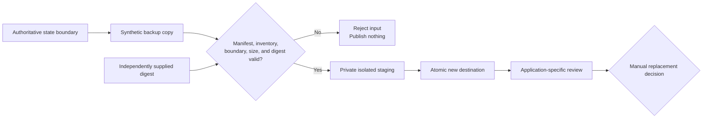

# Recovery Boundaries and Storage-Ready Startup

## Problem

A successful backup command does not prove recoverability. A restore can still
fail by accepting corrupted input, mixing different authority boundaries,
writing through unsafe archive metadata, overwriting live state, or publishing
partial output. Separately, a storage-dependent service can start against an
ordinary local directory when its network mount is absent, creating divergent
state that looks superficially healthy.

The public evidence needed to answer two questions without exposing private
backup configuration:

1. Can an untrusted synthetic backup be validated and restored without touching
   authoritative data?
2. Can service startup depend on the expected mounted storage boundary rather
   than path existence or timing alone?

## Constraints

- Production backup jobs, exports, schedules, credentials, paths, identifiers,
  and restored data cannot enter the public repository.
- VM-local transactional state and shared bulk data must remain distinct
  authority boundaries.
- A restore must never overwrite an existing destination or publish partial
  output.
- The destination parent must be a private namespace owned by the restore
  identity.
- Corruption, unsafe paths, links, special files, inventory mismatch, and
  boundary confusion must fail before destination publication.
- The public exercise must run unprivileged, offline, and entirely in temporary
  storage.
- The storage-startup example must rely on systemd dependency and assertion
  semantics rather than shell polling or mounting storage itself.
- Synthetic evidence must not be presented as proof of private PBS, Restic, VM
  backup, or operated restore behavior.

## Decision

Publish one strict synthetic recovery model and make the selected state boundary
part of every restore decision. Require a complete-archive SHA-256 from an
independent channel, then validate an exact manifest and tar-member inventory
before creating a staging directory. Restore only regular files, assign fixed
safe modes, and atomically publish to a destination that did not previously
exist. Keep replacement of authoritative data outside the restore transaction as
an explicit manual gate.

For storage-aware startup, use `RequiresMountsFor` and network ordering together
with mount-point and read-write assertions. Require a non-secret marker whose
content identifies the expected `shared-bulk-data` boundary. The workload does
not mount storage, guess readiness with sleeps, or start merely because the path
exists.

## Recovery Flow

The public flow ends at the replacement decision. It does not automate mutation
of authoritative state.

## Implementation

[`automation/recovery`](../../automation/recovery) contains:

- a strict model separating `service-local-state` from `shared-bulk-data`;
- a bounded uncompressed-tar format with an exact manifest schema;
- duplicate-key JSON rejection and conservative identifiers and paths;
- complete external and per-file SHA-256 validation;
- exact manifest-to-member inventory, zero-only trailer checks, and resource
  limits;
- rejection of traversal, links, devices, FIFOs, sparse files, extra members,
  parent-file collisions, and wrong-boundary archives;
- a private sibling staging directory, fixed `0750`/`0640` modes, file and
  directory synchronization, and Linux atomic no-replace publication;
- dynamic malicious fixtures and 27 policy and transaction tests; and
- a hardened synthetic systemd unit with mount, exact marker-content, and
  startup assertions.

The public safety check also rejects common archive, dump, VM-image, backup, and
restore-output paths to reduce the risk of generated recovery material being
added as portfolio evidence.

## Failure Handling

| Failure | Fail-closed behavior |
|---|---|
| Archive differs from the independently supplied digest | Reject before tar parsing |
| Manifest JSON is malformed, ambiguous, or extended | Reject the archive |
| Archive boundary differs from the selected authority | Reject before staging |
| Member is outside an included root or attempts traversal | Reject without writing an outside path |
| Archive contains a link, directory, sparse file, device, or FIFO | Reject the complete archive |
| Inventory, size, or file digest differs | Reject before destination publication |
| Destination exists or its parent is linked or shared-writable | Refuse the transaction |
| Local staging write fails | Remove staging and leave destination absent |
| Parent namespace changes while staging | Reject without publishing through the replacement path |
| Publication succeeds but parent synchronization fails | Report ambiguous durability and retain the visible destination for review |
| Required storage is not a read-write mount | systemd assertion prevents startup |
| Mounted data differs from the exact public boundary marker | Pre-start validation prevents startup |

## Validation

The evidence includes 27 unit tests covering model schema, archive verification,
restore behavior, unsafe input classes, limits, cleanup, CLI errors, and systemd
policy. `systemd-analyze verify` accepts the complete unit.

The
[dated isolated restore drill](../../evidence/drills/2026-08-24-isolated-synthetic-restore.md)
generates all material under a temporary root. It verifies and restores exact
synthetic bytes, checks fixed modes, rejects corruption with the original
external digest, rejects traversal and symbolic-link input, rejects boundary
confusion, injects a staging-write failure, confirms exact restored inventory and
failed-path absence, and confirms complete workspace cleanup.

## Result

The repository now demonstrates a repeatable isolated restore transaction rather
than relying on backup-design assertions alone. It also provides an executable
storage-readiness policy that distinguishes an expected mounted boundary from an
empty local path.

This completes the third v1 engineering case study and supports a `Validated`
claim for the synthetic restore. It supports an `Implemented` claim for the
public systemd policy, but not an `Operated` claim for private backup or storage
behavior.

## Limitations

- The synthetic format does not execute or validate PBS, Restic, hypervisor,
  snapshot, pruning, or off-host transfer workflows.
- SHA-256 provides integrity, not authenticity, unless the expected digest is
  delivered through a trusted independent channel.
- Encryption, signing, key recovery, immutable storage, ownership, ACLs, xattrs,
  security labels, hardlinks, and sparse-file restoration are outside scope.
- The restore does not quiesce applications or perform database-native or
  semantic application validation.
- Atomic directory publication does not prove every filesystem's power-loss
  behavior.
- Root or another process using the same restore identity remains inside the
  trusted local namespace and can mutate its files.
- The systemd evidence is static. It does not exercise an actual mount failure,
  boot race, runtime mount loss, stale network filesystem, or workload.
- No private backup job, schedule, restore, or operated recovery outcome is
  evidenced by this case study.
