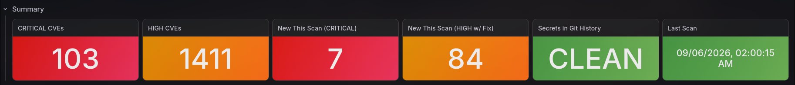
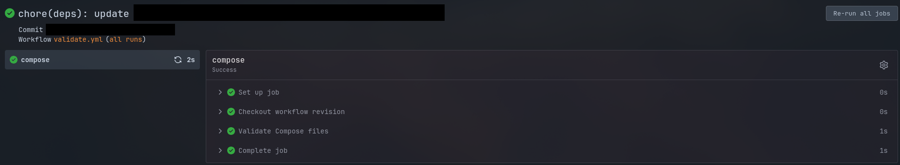
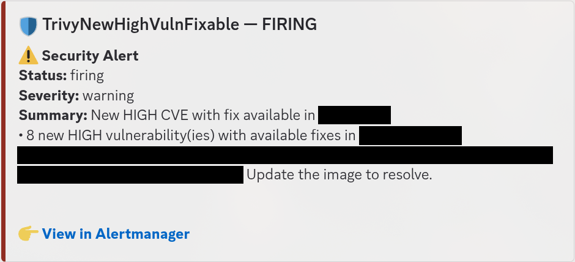
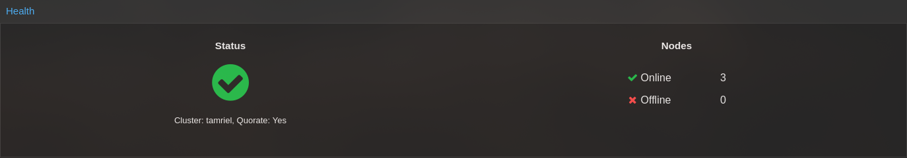

# Screenshot Evidence

## Runtime Gallery

Four reviewed captures from the operated environment. Click an image to open it
at full resolution. Capture months, redactions, and claim boundaries are recorded
in the linked review records; these are point-in-time observations, not uptime or
recovery tests.

### Vulnerability Management

[](grafana-security-dashboard.png)

*Trivy dashboard showing vulnerability totals and new critical and fixable HIGH findings.*

The displayed "Secrets in Git History" / "CLEAN" label is not evidence of a
complete-history audit. The [public Trivy pipeline](../../automation/trivy/README.md#secret-scanning-boundary)
scans the current tree; this portfolio's Git-history audit is a separate control.

[Redaction and review details](grafana-security-dashboard.review.md)

### Forgejo Validation

[](forgejo-validation-run.png)

*Successful Forgejo Compose validation associated with a dependency-update pull request.*

[Redaction and review details](forgejo-validation-run.review.md)

### Actionable Security Alert

[](security-scan-alert.png)

*Trivy alert delivered to Discord for eight new high-severity findings with available fixes.*

[Redaction and review details](security-scan-alert.review.md)

### Proxmox Cluster Health

[](proxmox-cluster-summary.png)

*Proxmox cluster health showing three nodes online and quorum established.*

[Redaction and review details](proxmox-cluster-summary.review.md)

## Publication Rules

This directory accepts only final, reviewed screenshots. Original captures and
working redaction files stay outside the repository.

The deny-by-default `.gitignore` requires each image and its same-name `.review.md`
record to be force-added after review. For example:

```text
grafana-security-dashboard.png
grafana-security-dashboard.review.md
```

## Review Record Template

```markdown
# Screenshot Review: <title>

- Capture month: YYYY-MM
- Claim demonstrated: <validation-matrix claim>
- Source: Real operated environment / synthetic fixture
- Cropped to minimum evidence: Yes
- Opaque redactions applied: Yes
- Browser URL removed: Yes / Not present
- Hostnames and addresses removed: Yes
- Usernames, emails, and IDs removed: Yes
- Hashes, tokens, and fingerprints removed: Yes
- Owner-approved retained values: None / <specific values and rationale>
- Metadata stripped: Yes
- OCR output reviewed: Yes
- Second reviewer: <name or handle>
- Notes: <what remains visible and why it is safe>
```

## Capture Boundaries

Capture only the minimum region described below. Browser chrome, navigation,
sidebars, notifications, and unrelated rows should remain outside the capture
rather than being redacted afterward.

| Filename | Evidence to retain | Content to remove or redact |
|---|---|---|
| `grafana-security-dashboard.png` | Severity totals and new critical/fixable HIGH findings; original Last Scan timestamp retained with owner approval | Surrounding tables, navigation, repository/image references, and user identity |
| `forgejo-validation-run.png` | Workflow and job names, successful checkout and Compose-validation steps; not proof of required-check enforcement | Repository and organization names, actor identity, commit hash, pull-request number, image/version details, and surrounding navigation |
| `security-scan-alert.png` | One delivered notification showing severity, new fixable findings, firing status, and an update instruction; not proof of scan completeness or remediation | Repository, image reference/version/digest, sender header, and message timestamp |
| `proxmox-cluster-summary.png` | Cluster health, quorum state, and aggregate online/offline node counts; project-aligned cluster name retained with owner approval | Node tree, addresses, VM or storage IDs, guest names, account header, task history, exact versions, and resource totals |

Public CVE identifiers and generic product labels may remain visible. Opaque
redaction must fully cover each private value; do not replace real labels with
fabricated labels inside the image.

Dependency-update and backup or recovery screenshots remain approved later
targets, but they are not part of the initial four-image v1 set.
